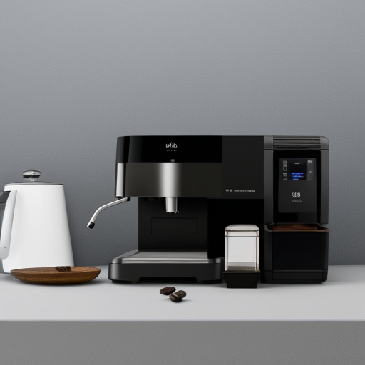

<div align="center">
<h1>
    <a name="readme-top"></a>
    
    <b> JobAppTrackr</b>
    
</h1>

<div align="center">

<p>Throwaway branch for setting up ASP.NET Core Web API + MongoDB connection!</p>

Badges!

[](https://github.com/Bhodrolok/JobAppTrackr/issues)
[](https://github.com/Bhodrolok/JobAppTrackr/issues?q=is%3Aissue+is%3Aclosed)
[](http://standardjs.com/)
[](https://learn.microsoft.com/en-us/dotnet/csharp/fundamentals/coding-style/coding-conventions)
[](https://github.com/Bhodrolok/JobAppTrackr/pulls)


</div>

### Track and manage your job applications on the web!

<h3> Built using </h3>

[](https://reactjs.org/)
[](https://protonmail.com)

</div>

---
<details>
  <summary>Table of Contents 🚩</summary>
  <ol>
    <li>
      <a href="#inspiration">Inspiration</a>
    </li>
    <li>
        <a href="#about-project">Project Goals & Scope</a>
    </li>
    <li><a href="#some-info">High-Level Overview </a>
    <li><a href="#features">Key Features</a>
    <li><a href="#too-much-time">Configuration</a></li>
    <!--FUTURE!
    <li><a href="#contributing">Contributing</a></li>
    <li><a href="#license">License</a></li>
    <li><a href="#contact">Contact</a></li>
    -->
    <li><a href="#extra">Feedback</a></li>
    <li><a href="#contributing">Contributing</a></li>
  </ol>
</details>

---

<h2 id="inspiration"> Inspiration :milky_way: </h2>

Let's face it. After spending God knows how long on getting your resume and cover letter tweaked and perfected for applying for each and every position, the last thing on your mind afterwards is noting them down into your Excel worksheet for tracking and continously having to monitor it and update it by yourself. That's simply unneccesarrily difficult and no fun. Presenting.... JobAppTrackr!

<p align="right">(<a href="#readme-top">back to top :arrow_up: </a>)</p>

<h2 id="about-project"> Project Goals :bow_and_arrow: & Scope :world_map: </h2>

The primary goal of this project is to create a web application that allows users to track and manage their job applications online without extra hassle.

JobAppTrackr aims to provide a seamless, user-friendly and easy to navigate platform that providers job seekers with the ability to add, edit, and delete their job applications. This will enable them to track application status and upcoming interviews.

For now, it is planned that the project will consist of a Single-Page Application (SPA) built with a React frontend, an ASP.NET Core API service as the backend and a MongoDB database to serve as data storage. 

A rough roadmap of this project can be found [here](https://github.com/users/Bhodrolok/projects/1). This includes almost all of the planned, in-progress and implemented functionalities and features of JobAppTrackr.

Requirements were prioritized using the [MoSCoW method](https://en.wikipedia.org/wiki/MoSCoW_method).
<p align="right">(<a href="#readme-top">back to top :arrow_up: </a>)</p>


<h2 id="some-info"> High-Level Overview :question: </h2>

The web app is currently planned to function as a SPA, to provide end-users with a fast, responsive and smooth user experience loading only the necessary data instead of having to wait for a new page to load each time.

As such the application architecture has been divided into 3 components: 

1. Frontend (FE)
    * React
    * UI design components and pages
    * Integrate FE with backend API

2. Backend (BE)
    * ASP.NET Core 
    * Exposed RESTful API service and endpoints to be consumed by FE
    * JWT Authentication
    * Integrate BE with MongoDB database

3. Database (DB)
    * MongoDB
    * Data storage
    * High performance, flexible document-based data model, scalability and ease of integration with FE and BE.

In this [SPA software architecture pattern/model](https://livebook.manning.com/book/spa-design-and-architecture/chapter-1/11), the FE will be responsible for rendering the UI, handling end-user interactions and communicating with the backend REST API to fetch and store data. 
The BE will be responsible for processing incoming requests from the FE, handling logic and communicating with the DB. The database is responsible for storing and retrieving data for the backend to use.

I decided to decouple the 3 major components so as to make the application more modular and scalable. This approach can facilitate each component being easily upgraded, replaced or even switched out with some other technology/stack without disrupting the stability of the system. 

Overall, by using this architecture, the focus will be on delivering only the necessary data to the client's frontend, while keeping the backend lightweight and scalable!

As this is very much a learning project, I hope to develop a more granular understanding about modern software design patterns and of the underlying technologies involved in building modern web applications, and use that knowledge to make JobAppTrackr better iteratively.

* Deployment
    * W.I.P.


<p align="right">(<a href="#readme-top">back to top :arrow_up: </a>)</p>

<h2 id="features"> Features :high_brightness: </h2>

So far!

<details>
    <summary> 
        <b>User Registration and Authentication</b> 
    </summary>
     Enable users to create accounts and log in securely.
</details>

<details>
    <summary> 
        <b>Job Application Tracking</b> 
    </summary>
     Enable users to track job applications, and their status, efficiently throughout their job search. Status includes attributes such as URL of job posting, position, date applied,company name, resume/cover letter used to apply, etc.
</details>

<details>
    <summary> 
        <b>Dashboard View</b> 
    </summary>
     Provide users with a bird's-eye view of job application status and progress,  helping them stay organized and on top of their job search.
</details>

<details>
    <summary> 
        <b>Scalability</b> 
    </summary>
     Allow for easy scaling, upgrading and adding of new features over time as the application grows.
</details>

<p align="right">(<a href="#readme-top">back to top :arrow_up: </a>)</p>

<h2 name="too-much-time"> Building & Configuration</h2>
<p>TODO!</p>
<!--
You can tweak the Docker Compose file and tweak the values defined in `environment`.
It is recommended to use the `--no-cache` option when building images.
To make things even simpler, a `.env` file which contains the necessary configuration for the application to run, can be used. 
This way, you can build a image by running: `docker-compose --env-file ./path/to/.env build --no-cache --force-rm`
You can create the .env file and place them in the `peer` folder (and the `proxy` folder as well if you want to run the <b> Proxy</b> locally!).
The general format of a `.env` file is:
```
VARIABLE1=YOUR_VALUE1
VARIABLE2=YOUR_VALUE2 
```
You can read more about the environment variables [here](./docs/README.md#environment-variables).
-->

<p align="right">(<a href="#readme-top">back to top :arrow_up: </a>)</p>

<h2 id="extra"> What's next for JobAppTrackr :dart: </h2>

Lots of features planned ahead! <br><br>
<p align="right">(<a href="#readme-top">back to top :arrow_up: </a>)</p>


<h2 id="contributing">Contributing :scroll: </h2>

This is an open source project. Any contributions (suggestions, bug fixes, documentation improvements, translations) will be greatly appreciated!

<p align="right">(<a href="#readme-top">back to top :arrow_up: </a>)</p>
